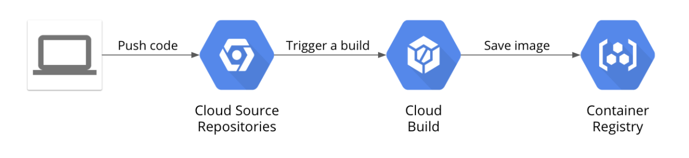

# DevOps Pipeline Google Cloud 

Build a continuous integration pipeline using Cloud Source Repositories, Cloud Build, build triggers, and Container Registry.



## Init Git Repository

To the Cloud Console go to Activate Cloud Shell

``` shell
mkdir gcp-course
cd gcp-course
gcloud source repos clone devops-repo
cd devops-repo
```

## Python App

Into folder devops-repo, create new file main.py 

``` shell 
vi main.py 
``` 

See the main.py file into my repo

Create new folder templates 

``` shell
mkdir templates
vi layout.html
```

See the layout.html into /templates folder

Same with the file index.html

```shell
vi index.html
```

 Into devops-repo, create a new file requirement.txt

 ``` shell
 echo "Flask==1.1.1" > requirement.txt
 ```

 First, you need to add all the files you created to your local Git repo. In Cloud Shell, enter the following code:

 ``` shell 
cd ~/gcp-course/devops-repo
git add --all
git config --global user.email "you@example.com"
git config --global user.name "Your Name"
git commit -a -m "Initial Commit"
git push origin master
```

## Deployement Web app in Cloud Shell 

``` shell
cd ~/gcp-course/devops-repo
sudo pip3 install -r requirements.txt
python3 main.py
```

Click on the web preview "Preview on port 8080."

You can edit the file main.py

``` python
model = {"title": "Hello Tux Fans."}
```

Redeployement on git 

``` shell
cd ~/gcp-course/devops-repo
git commit -a -m "Second Commit"
git push origin master
```

Click on the web preview "Preview on port 8080." View change.

## Docker build

Create a Dockerfile 

``` shell 
cd ~/gcp-course/devops-repo
vi Dockerfile
```

See the Dockerfile into my repo 

## Manage Docker Images with Cloud Build and Container Registry

Into the cloud shell 

``` shell 
cd ~/gcp-course/devops-repo
echo $DEVSHELL_PROJECT_ID
```

DEVSHELL_PROJECT_ID automatically has your current project ID stored.

``` shell 
gcloud builds submit --tag gcr.io/$DEVSHELL_PROJECT_ID/devops-image:v0.1 .
```

Cloud Console and on the Navigation menu, click Container Registry. Your image should be on the list.

Navigate to the Cloud Build service, and your build should be listed in the history.

Now go to Compute Engine and create new instance

| Property        | Value                                                                                   |
|-----------------|-----------------------------------------------------------------------------------------|
| Container       | Deploy a container image to this VM instance                                            |
| Container image | gcr.io/<your-project-id-here>/devops-image:v0.1 (change the project ID where indicated) |
| Firewall        | Allow HTTP traffic                                                                      |

``` shell 
cd ~/gcp-course/devops-repo
git add --all
git commit -am "Added Docker Support"
git push origin master
```

## Automate Builds with Triggers

Container Registry. At this point, you should have a folder named devops-image with at least one container in it.

Cloud Build. The Build history page should open, and one or more builds should be in your history.

Click the Triggers link on the left.

Click Create trigger.

Name the trigger devops-trigger

Select your devops-repo Git repository.

Select .*(any branch) for the branch.

Choose Dockerfile for Build Configuration and select the dafault image.

Accept the rest of the defaults, and click Create.

To test the trigger, click Run and then Run trigger.

Click the History link and you should see a build running. Wait for the build to finish, and then click the link to it to see its details.

Edit main.py 

``` python
model = {"title": "Hello Trigger Fans."}
```

``` shell
cd ~/gcp-course/devops-repo
git commit -a -m "Testing Build Trigger"
git push origin master
```

## Test your build changes

When the build completes, click on it to see its details. Under Execution Details, copy the image link, format should be gcr.io/qwiklabs-gcp-00-f23112/devops-repoxx34345xx.

Go to the Compute Engine service. As you did earlier, create a new virtual machine to test this image. Select the box to deploy a container image to the VM, and paste the image you just copied.

Select Allow HTTP traffic. 

When the machine is created, test your change by making a request to the VM's external IP address in your browser. Your new message should be displayed.